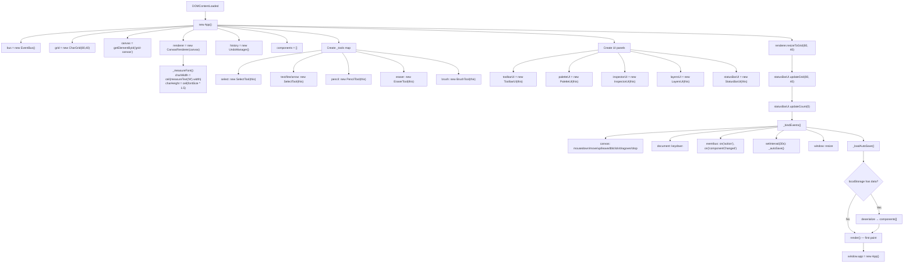
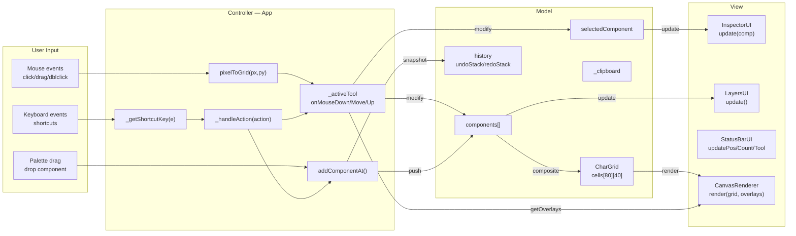
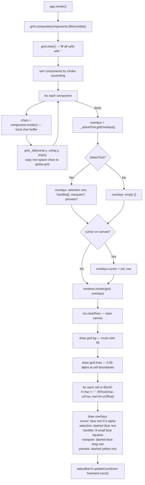
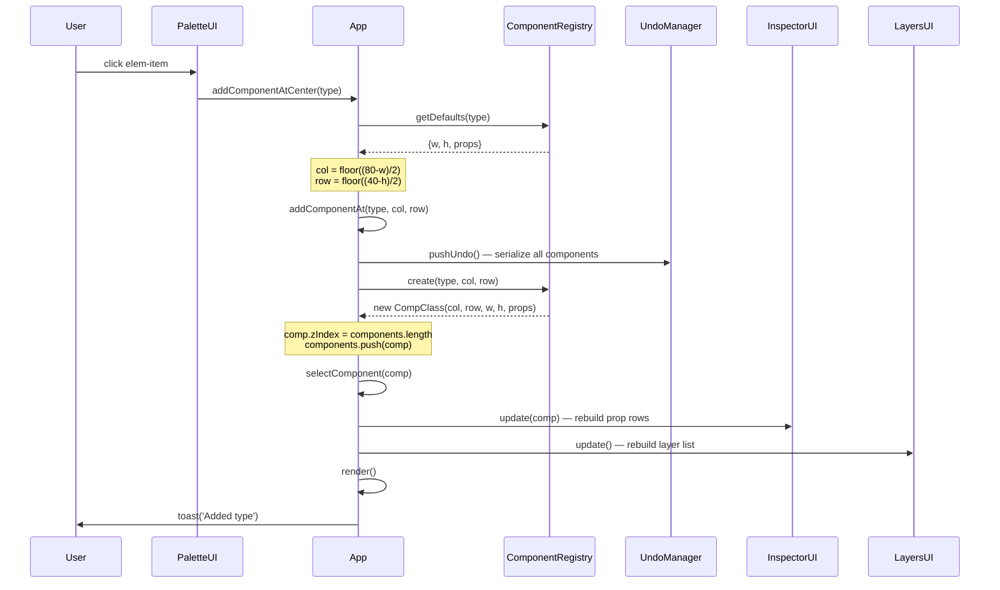
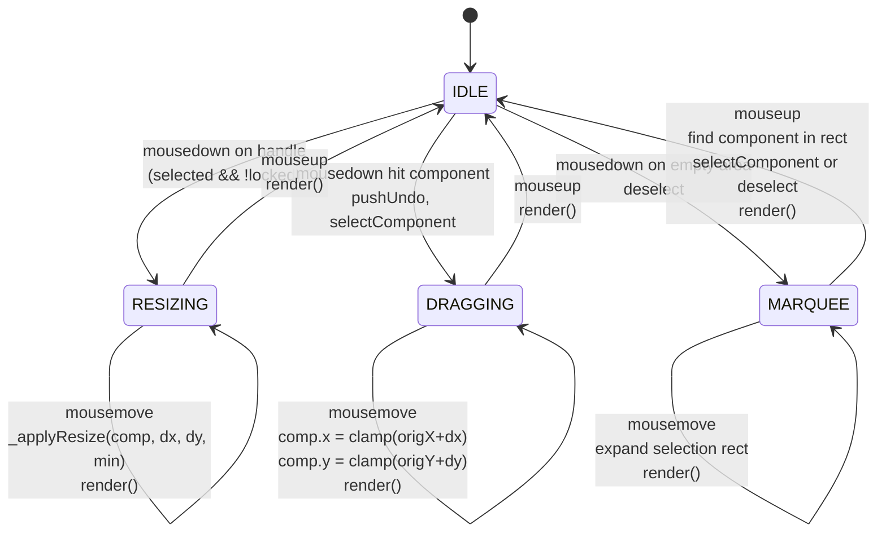
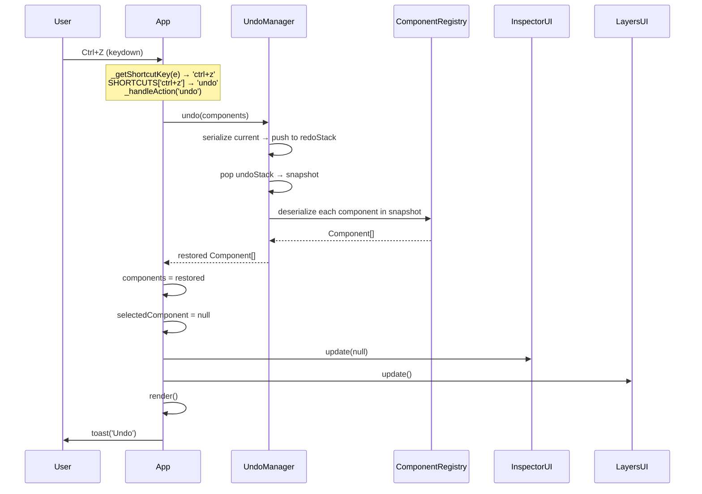
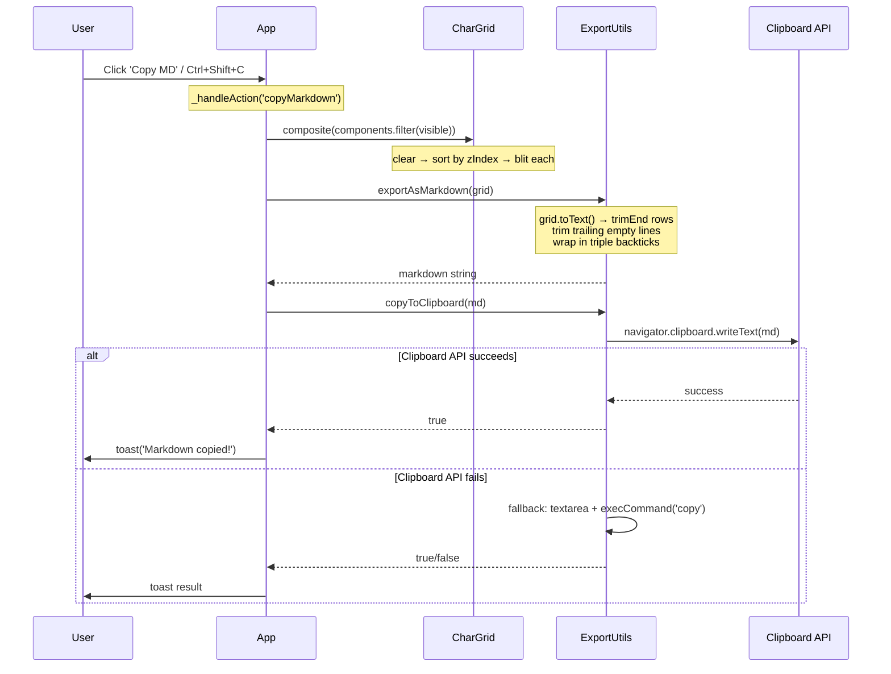

# KaomojiMarkdownDesign

## 1. Project Overview

Browser-based ASCII wireframe editor for designing UI mockups using Unicode box-drawing characters. Compiles into a single portable HTML file (150KB) with zero external dependencies. Inspired by [mockdown.design](https://www.mockdown.design/).

`$PROJECT_ROOT` = this directory (`${PYTHON_WS}/KaomojiMarkdownDesign`)

**Quick Reference:**
```bash
# Development (multi-file, script tags)
open $PROJECT_ROOT/src/index.html

# Build single-file dist
bash $PROJECT_ROOT/build.sh
# Output: $PROJECT_ROOT/dist/kaomoji-markdown-design.html (150KB)
```

**Key Files:**

| File | Purpose |
|------|---------|
| `src/index.html` | HTML shell + all CSS + `<script>` tags in dependency order |
| `src/utils/constants.js` | All global constants: grid size, colors, shortcuts, tool defs |
| `src/utils/boxdraw.js` | `BORDER_CHARS` lookup table (5 styles × 15 positions) + helper functions |
| `src/core/grid.js` | `CharGrid` class: 2D char buffer + compositing |
| `src/core/renderer.js` | `CanvasRenderer` class: HTML5 Canvas `fillText` per cell |
| `src/core/history.js` | `UndoManager` class: 50-level snapshot undo/redo |
| `src/core/export.js` | `ExportUtils` object: clipboard, file, localStorage I/O |
| `src/components/base.js` | `BaseComponent` abstract class + `_componentIdCounter` |
| `src/components/registry.js` | `ComponentRegistry` factory + `ELEMENT_PALETTE` array |
| `src/components/group.js` | `GroupComponent`: container for MkGroup/DeGroup |
| `src/components/*.js` | 20 component type files (one class each) |
| `src/tools/base.js` | `BaseTool` interface class |
| `src/tools/select.js` | `SelectTool`: click/drag/resize with 8 handles + marquee |
| `src/tools/pencil.js` | `PencilTool`: freehand `*` char drawing |
| `src/tools/eraser.js` | `EraserTool`: set chars to space |
| `src/tools/brush.js` | `BrushTool`: draw with box-drawing chars (h/v auto-detect) |
| `src/ui/app.js` | `App` class: main orchestrator, event binding, all actions |
| `src/ui/eventbus.js` | `EventBus` class: simple pub/sub |
| `src/ui/toolbar.js` | `ToolbarUI`: top button bar binding |
| `src/ui/palette.js` | `PaletteUI`: left panel tools + element library |
| `src/ui/inspector.js` | `InspectorUI`: right panel property editor |
| `src/ui/layers.js` | `LayersUI`: right panel layer list |
| `src/ui/statusbar.js` | `StatusBarUI`: bottom info bar |
| `build.sh` | Bash script: concatenate 40 JS files into single HTML |
| `dist/kaomoji-markdown-design.html` | Portable single-file output |

---

## 2. Development Plan

### 2.1 Goal

Create a browser-based ASCII wireframe editor that:
1. Renders UI mockups using Unicode box-drawing characters on an 80×40 character grid
2. Provides 20 pre-built UI component types with 5 border styles
3. Supports interactive editing: select, move, resize, draw, undo/redo
4. Exports to Markdown code blocks for documentation
5. Compiles into a single portable HTML file with zero external dependencies
6. Uses a dark theme inspired by Catppuccin Mocha

### 2.2 Overview

**Architecture**: MVC with HTML5 Canvas rendering.

```
App (orchestrator)
├── EventBus (pub/sub)
├── CharGrid (80×40 model — 2D string[][])
├── CanvasRenderer (view — fillText per cell)
├── UndoManager (50-level snapshot JSON.stringify)
├── ComponentRegistry (factory + deserialize)
│   └── 20 Component types (each renders to local char[][])
├── Tools (strategy pattern)
│   ├── SelectTool (move/resize/marquee)
│   ├── PencilTool (freehand '*')
│   ├── EraserTool (set to space)
│   └── BrushTool (box-drawing h/v)
└── UI Panels
    ├── ToolbarUI (top action buttons)
    ├── PaletteUI (left: tools + elements + draw)
    ├── InspectorUI (right: property editor)
    ├── LayersUI (right: z-order list)
    └── StatusBarUI (bottom info)
```

**Rendering Pipeline** (called on every state change):
1. `App.render()` calls `grid.composite(visibleComponents)`
2. `CharGrid.composite()`: sort by zIndex ascending → each component's `render()` returns local `char[][]` → `_blit()` non-space chars onto grid
3. `App.render()` builds overlays object from active tool
4. `CanvasRenderer.render(grid, overlays)`: clear canvas → draw grid lines → `fillText` each non-space cell → draw overlay layers (cursor, selection, handles, marquee, preview)

**Why Canvas not DOM `<pre>`**: Precise per-character pixel positioning, efficient 3200-cell rendering loop, trivial `floor(px/charWidth)` mouse-to-grid mapping, overlay support without z-index juggling.

**Font**: System monospace `"Courier New", "Courier", monospace` — zero external deps. `charWidth` measured at startup via `ctx.measureText('M').width` (ceil'd). `charHeight = ceil(fontSize * 1.5)`.

### 2.3 Features

#### 2.3.1 Component Library (20 types)

| # | Type | Class | ASCII Pattern | Default W×H | Min W×H | Props |
|---|------|-------|---------------|-------------|---------|-------|
| 1 | `textbox` | `TextBoxComponent` | Free text (multi-line via `\n`) | 10×1 | 1×1 | `text: 'Text'` |
| 2 | `box` | `BoxComponent` | `┌─┐│ │└─┘` rectangle | 12×6 | 3×3 | — |
| 3 | `button` | `ButtonComponent` | `[ Label ]` | 10×1 | 5×1 | `label: 'Button'` |
| 4 | `input` | `InputComponent` | `[___________]` or `[placeholder]` | 16×1 | 5×1 | `placeholder: ''` |
| 5 | `card` | `CardComponent` | Box + title row + `├──┤` divider at row 2 | 20×8 | 5×4 | `title: 'Card Title'` |
| 6 | `table` | `TableComponent` | Outer box + `┬┼┴` vertical dividers + header divider | 24×7 | 5×4 | `cols:3, rows:3, headers:['Col1','Col2','Col3']` |
| 7 | `modal` | `ModalComponent` | Box + title + `×` close + header divider + action row `[ Cancel ] [ OK ]` | 30×12 | 10×6 | `title: 'Modal Title'` |
| 8 | `tabs` | `TabsComponent` | `[Active] Tab2 Tab3` + `───` underline | 30×2 | 8×2 | `tabs:['Tab 1','Tab 2','Tab 3'], activeIndex:0` |
| 9 | `navbar` | `NavBarComponent` | `Logo  Home  About  Contact  [Sign In]` | 40×1 | 10×1 | `logo:'Logo', links:['Home','About','Contact'], action:'Sign In'` |
| 10 | `dropdown` | `DropdownComponent` | `[Option   ▾]` | 14×1 | 5×1 | `value: 'Option'` |
| 11 | `search` | `SearchComponent` | `[/ Search...     ]` | 20×1 | 8×1 | `placeholder: 'Search...'` |
| 12 | `checkbox` | `CheckboxComponent` | `[x] Label` / `[ ] Label` | 12×1 | 4×1 | `label:'Option', checked:true` |
| 13 | `radio` | `RadioComponent` | `(o) Label` / `( ) Label` | 12×1 | 4×1 | `label:'Option', selected:true` |
| 14 | `toggle` | `ToggleComponent` | `[━●] On` / `[●━] Off` | 8×1 | 5×1 | `on:true, label:''` |
| 15 | `progress` | `ProgressComponent` | `[████░░░░] 50%` | 16×1 | 8×1 | `value: 50` |
| 16 | `breadcrumb` | `BreadcrumbComponent` | `Home > Docs > About` | 24×1 | 5×1 | `items:['Home','Docs','About']` |
| 17 | `pagination` | `PaginationComponent` | `< 1 [2] 3 4 5 >` | 16×1 | 7×1 | `pages:5, current:1` |
| 18 | `separator` | `SeparatorComponent` | `────────────────────` | 20×1 | 2×1 | — |
| 19 | `line` | `LineComponent` | `────────` or `│` (vertical) | 8×1 | 1×1 | `orientation:'horizontal'` |
| 20 | `arrow` | `ArrowComponent` | `───────→` or `↓` | 8×1 | 2×1 | `orientation:'horizontal', direction:'right'` |

#### 2.3.2 Border Styles (5)

| Style | tl | t | tr | l | r | bl | b | br | h | v | cross | tee_down | tee_up | tee_right | tee_left |
|-------|----|----|----|----|----|----|----|----|----|----|-------|----------|--------|-----------|----------|
| `single` | `┌` | `─` | `┐` | `│` | `│` | `└` | `─` | `┘` | `─` | `│` | `┼` | `┬` | `┴` | `├` | `┤` |
| `heavy` | `┏` | `━` | `┓` | `┃` | `┃` | `┗` | `━` | `┛` | `━` | `┃` | `╋` | `┳` | `┻` | `┣` | `┫` |
| `double` | `╔` | `═` | `╗` | `║` | `║` | `╚` | `═` | `╝` | `═` | `║` | `╬` | `╦` | `╩` | `╠` | `╣` |
| `rounded` | `╭` | `─` | `╮` | `│` | `│` | `╰` | `─` | `╯` | `─` | `│` | `┼` | `┬` | `┴` | `├` | `┤` |
| `ascii` | `+` | `-` | `+` | `\|` | `\|` | `+` | `-` | `+` | `-` | `\|` | `+` | `+` | `+` | `+` | `+` |

Arrow characters: `right: →`, `left: ←`, `up: ↑`, `down: ↓`

#### 2.3.3 Tools (7)

| Tool | Class | Key | Icon | Cursor | Behavior |
|------|-------|-----|------|--------|----------|
| Select | `SelectTool` | V | `◇` | `default` | Click: hit-test + select. Drag: move. Handle-drag: resize. Empty-drag: marquee |
| Text | (uses `SelectTool`) | T | `T` | `default` | Same as Select (double-click to edit text inline) |
| Line | (uses `SelectTool`) | L | `─` | `default` | Same as Select |
| Arrow | (uses `SelectTool`) | A | `→` | `default` | Same as Select |
| Pencil | `PencilTool` | P | `✎` | `crosshair` | Draw `*` chars on freehand layer |
| Eraser | `EraserTool` | E | `◻` | `crosshair` | Set chars to space on freehand layer |
| Brush | `BrushTool` | B | `▓` | `crosshair` | Draw `─` (horizontal) or `│` (vertical) based on movement direction |

#### 2.3.4 Editor Features
- **Undo/Redo**: 50-level snapshot stack via `JSON.stringify(components.map(c => c.serialize()))`
- **Copy/Paste/Cut**: Serialize selected component to clipboard object, paste with +2/+1 offset
- **Inline text editing**: Double-click on component with `text`/`label`/`title` prop → position `<textarea>` over component, Enter to commit, Escape to cancel
- **Drag-and-drop**: HTML5 drag from palette `elem-item` → drop on canvas → `addComponentAt(type, col, row)`
- **Auto-save**: `setInterval(30000)` → `ExportUtils.saveToLocalStorage(components)` → loads on startup
- **Save/Load file**: JSON file with `.kaomoji.json` extension via `Blob`+`URL.createObjectURL` / `FileReader`
- **Copy Markdown**: Composite grid → `exportAsMarkdown()` → `navigator.clipboard.writeText()` with `execCommand('copy')` fallback

#### 2.3.5 Keyboard Shortcuts

All `ctrl+` shortcuts have `meta+` (macOS Cmd) equivalents. Shortcuts are ignored when focus is on `INPUT`, `TEXTAREA`, or `SELECT` elements.

| Key | Action |
|-----|--------|
| `ctrl+z` / `meta+z` | `undo` |
| `ctrl+shift+z` / `meta+shift+z` | `redo` |
| `ctrl+y` / `meta+y` | `redo` |
| `ctrl+c` / `meta+c` | `copy` |
| `ctrl+v` / `meta+v` | `paste` |
| `ctrl+x` / `meta+x` | `cut` |
| `ctrl+a` / `meta+a` | `selectAll` (selects last component) |
| `ctrl+s` / `meta+s` | `save` (file download) |
| `ctrl+shift+s` / `meta+shift+s` | `saveAs` |
| `ctrl+n` / `meta+n` | `new` (clear canvas with confirm) |
| `ctrl+shift+c` / `meta+shift+c` | `copyMarkdown` |
| `Delete` / `Backspace` | `delete` selected |
| `Escape` | `deselect` |
| `v` / `t` / `l` / `a` / `p` / `e` / `b` | Switch to tool: select/text/line/arrow/pencil/eraser/brush |

### 2.4 Key Algorithms

#### 2.4.1 Grid Compositing (`CharGrid.composite`)
```
composite(components):
  clear all cells to ' '
  sorted = [...components].sort((a,b) => a.zIndex - b.zIndex)  // ascending
  for each comp in sorted:
    rendered = comp.render()  // returns char[][] (local coords, w×h)
    if !rendered: continue
    _blit(rendered, comp.x, comp.y)

_blit(charArray, offsetX, offsetY):
  for r in 0..charArray.length:
    gridRow = offsetY + r
    if gridRow out of bounds: continue
    for c in 0..charArray[r].length:
      gridCol = offsetX + c
      if gridCol out of bounds: continue
      if charArray[r][c] != ' ':      // space = transparent
        cells[gridRow][gridCol] = charArray[r][c]
```

#### 2.4.2 Mouse-to-Grid Conversion (`CanvasRenderer.pixelToGrid`)
```
pixelToGrid(px, py):
  col = floor(px / charWidth)
  row = floor(py / charHeight)
  return {col, row}
```
Mouse coordinates come from `e.clientX - canvas.getBoundingClientRect().left`.

#### 2.4.3 Hit Testing (`App.hitTest`)
```
hitTest(col, row):
  sorted = components.filter(visible && name != '_freehand')
                     .sort((a,b) => b.zIndex - a.zIndex)  // descending = top first
  for each comp in sorted:
    if comp.contains(col, row): return comp
  return null

contains(col, row):
  return col >= x && col < x+w && row >= y && row < y+h
```

#### 2.4.4 Resize Handles (`BaseComponent.getHandles`)
8 handles at bounding box corners/midpoints:
```
NW: (x, y)                 N: (x+floor(w/2), y)           NE: (x+w-1, y)
W:  (x, y+floor(h/2))                                     E:  (x+w-1, y+floor(h/2))
SW: (x, y+h-1)             S: (x+floor(w/2), y+h-1)       SE: (x+w-1, y+h-1)
```
Handle hit test: exact `col === handle.col && row === handle.row` match.

Resize logic (`SelectTool._applyResize`):
```
dir contains 'e': w = max(minW, origW + dx)
dir contains 'w': w = max(minW, origW - dx); x = origX + origW - w
dir contains 's': h = max(minH, origH + dy)
dir contains 'n': h = max(minH, origH - dy); y = origY + origH - h
clamp: x >= 0, y >= 0, x+w <= GRID_COLS, y+h <= GRID_ROWS
```

#### 2.4.5 Snapshot Undo (`UndoManager`)
```
push(components):
  snapshot = JSON.stringify(components.map(c => c.serialize()))
  undoStack.push(snapshot)
  if undoStack.length > 50: undoStack.shift()
  redoStack = []  // clear redo on new action

undo(currentComponents):
  if undoStack empty: return null
  redoStack.push(serialize(currentComponents))
  snapshot = undoStack.pop()
  return JSON.parse(snapshot).map(d => ComponentRegistry.deserialize(d))

redo(currentComponents): // mirror of undo
  if redoStack empty: return null
  undoStack.push(serialize(currentComponents))
  snapshot = redoStack.pop()
  return deserialize(snapshot)
```

#### 2.4.6 Box-Drawing Helpers

**`drawBox(chars, x, y, w, h, style)`**: Guard `w < 2 || h < 2`. Place tl/tr/bl/br at corners. Fill top/bottom edges with t/b. Fill left/right sides with l/r.

**`drawHDivider(chars, x, w, row, style)`**: Place `tee_right` at `[row][x]`, fill `h` chars, place `tee_left` at `[row][x+w-1]`.

**`drawVDivider(chars, col, y, h, style)`**: Place `tee_down` at `[y][col]`, fill `v` chars, place `tee_up` at `[y+h-1][col]`.

**`placeText(chars, x, y, text, maxWidth)`**: Write text chars left-to-right, truncate at `maxWidth` or row boundary. Skip if `y` out of bounds.

#### 2.4.7 Table Render Algorithm
```
render():
  draw outer box
  colWidth = floor((w - 1) / numCols)

  // Vertical dividers at c*colWidth for c=1..numCols-1
  for each vertical divider column cx:
    drawVDivider(chars, cx, 0, h, style)

  // Header divider at row 2
  drawHDivider(chars, 0, w, 2, style)

  // Fix intersection characters:
  for each cx at row 0:   chars[0][cx]   = tee_down
  for each cx at row 2:   chars[2][cx]   = cross
  for each cx at row h-1: chars[h-1][cx] = tee_up

  // Header text at row 1, each column offset cx+1
  for c in 0..numCols: placeText(chars, c*colWidth+1, 1, headers[c], colWidth-1)
```

#### 2.4.8 Modal Render Algorithm
```
render():
  if w < 10 || h < 6: return empty
  drawBox(chars, 0, 0, w, h, style)
  placeText(chars, 2, 1, title, w-6)     // title
  chars[1][w-3] = '×'                     // close button
  drawHDivider(chars, 0, w, 2, style)     // header divider
  actionRow = h - 3
  if actionRow > 2:
    drawHDivider(chars, 0, w, actionRow, style)
    cancelBtn = '[ Cancel ]'
    okBtn     = '[  OK  ]'
    placeText(chars, w-len(cancelBtn)-len(okBtn)-4, actionRow+1, cancelBtn)
    placeText(chars, w-len(okBtn)-2, actionRow+1, okBtn)
```

#### 2.4.9 Freehand Drawing (Pencil/Eraser/Brush)
All three tools use a hidden `_freehand` textbox component:
```
_freehand = TextBoxComponent at (0,0) with w=GRID_COLS, h=GRID_ROWS, zIndex=-1000
props.text = GRID_ROWS lines of GRID_COLS spaces, joined by '\n'
```
Drawing modifies individual characters in this text by splitting into lines, editing `lines[row]` at column position, then rejoining. Created on first draw if not exists.

- **Pencil**: Sets char at (col,row) to `'*'`
- **Eraser**: Sets char at (col,row) to `' '`
- **Brush**: Draws line from (fromCol,fromRow) to (toCol,toRow). Uses `h` char if `|dx| >= |dy|`, `v` char otherwise. Interpolates via `round(d*i/steps)`.

#### 2.4.10 SelectTool State Machine
```
mouseDown:
  if selected && !locked:
    handleDir = selected.getHandleAt(col, row)
    if handleDir: enter RESIZING, save orig x/y/w/h, pushUndo
  hit = hitTest(col, row)
  if hit: select(hit), if !locked: enter DRAGGING, save orig x/y, pushUndo
  else: deselect, enter MARQUEE

mouseMove:
  if RESIZING: _applyResize(dx, dy), render()
  if DRAGGING: comp.x = clamp(origX+dx), comp.y = clamp(origY+dy), render()
  if MARQUEE: update marquee x2/y2, render()

mouseUp:
  if MARQUEE with size > 1: find first component fully within rect, select it
  exit all states, render()
```

#### 2.4.11 Box-Drawing Character Merge (`mergeLineChars`)
When two components overlap on the grid, their border characters must merge into correct Unicode junctions instead of one simply overwriting the other.

**4-direction flag system** (`_BD_U=1, _BD_D=2, _BD_L=4, _BD_R=8`):
Each box-drawing character gets direction flags from `_BD_POS_DIRS`:
- Corners: `tl→D|R`, `tr→D|L`, `bl→U|R`, `br→U|L`
- Edges: `t/b/h→L|R`, `l/r/v→U|D`
- Tees: `tee_down→D|L|R`, `tee_up→U|L|R`, `tee_right→U|D|R`, `tee_left→U|D|L`
- Cross: `cross→U|D|L|R`

**Lookup tables** built dynamically from `BORDER_CHARS`:
- `_BOX_DIRS[char] → dirFlags` — direction flags for any box-drawing char (OR'd across all styles)
- `_BOX_STYLE[char] → styleName` — first style that defines the char
- `_BOX_RESULTS[style][dirFlags] → char` — result char for given direction combo in given style

**Merge algorithm**:
```
mergeLineChars(existing, incoming):
  1. If both are box-drawing chars (_BOX_DIRS has entries):
     combined = existingDirs | incomingDirs
     If combined == incomingDirs: return incoming (already covers all)
     Look up _BOX_RESULTS[incoming's style][combined]
     If found: return result
  2. Else fall back to diagonal line merge (_LINE_CHAR_DIRS):
     combined = existingLineDirs | incomingLineDirs
     Return _DIR_RESULT[combined] or incoming
  3. Default: incoming overwrites existing
```

**Examples**: `┐(D|L) + ┌(D|R) → ┬(D|L|R)`, `┤(U|D|L) + ├(U|D|R) → ┼(U|D|L|R)`

### 2.5 Complete Function List

#### `utils/constants.js` — Global Constants (no classes)
- `GRID_COLS = 80`, `GRID_ROWS = 40`
- `DEFAULT_FONT_FAMILY = '"Courier New", "Courier", monospace'`
- `DEFAULT_FONT_SIZE = 14`
- `MAX_UNDO_LEVELS = 50`
- `COLORS = { bg, gridLine, cellBg, text, textDim, cursor, selection, selectionBorder, handle, handleFill, panelBg, panelBorder, panelText, panelTextDim, panelHover, panelActive, accent, accentHover, toolbarBg, statusBg, statusText, error, success, warning }`
- `SHORTCUTS = { 'ctrl+z': 'undo', ... }` — 30 entries mapping key combos to action strings
- `TOOL_DEFS = [{ id, label, shortcut, icon }]` — 7 entries
- `BORDER_STYLES = ['single', 'heavy', 'double', 'rounded', 'ascii']`

#### `utils/boxdraw.js` — Box-Drawing Lookup + Helpers
- `BORDER_CHARS = { single: {...}, heavy: {...}, double: {...}, rounded: {...}, ascii: {...} }` — each with 15 position keys
- `ARROW_CHARS = { right: '→', left: '←', up: '↑', down: '↓' }`
- `drawBox(chars: string[][], x: int, y: int, w: int, h: int, style?: string): void`
- `drawHDivider(chars: string[][], x: int, w: int, row: int, style?: string): void`
- `drawVDivider(chars: string[][], col: int, y: int, h: int, style?: string): void`
- `placeText(chars: string[][], x: int, y: int, text: string, maxWidth?: int): void`
- `_BOX_DIRS: object` — char → direction flags (OR'd across all positions that define it)
- `_BOX_STYLE: object` — char → first style name that defines it
- `_BOX_RESULTS: object` — style → { dirFlags → char } lookup
- `mergeLineChars(existing: string, incoming: string): string` — merge two overlapping chars using 4-direction box merge then diagonal fallback

#### `core/grid.js` — `class CharGrid`
- `constructor(cols = GRID_COLS, rows = GRID_ROWS)` — creates `this.cells = string[][]`
- `_createEmpty(): string[][]` — returns rows×cols array filled with `' '`
- `clear(): void` — sets all cells to `' '`
- `getChar(col: int, row: int): string` — bounds-checked, returns `' '` if OOB
- `setChar(col: int, row: int, ch: string): void` — bounds-checked
- `composite(components: BaseComponent[]): void` — clear + sort by zIndex asc + blit each
- `_blit(charArray: string[][], offsetX: int, offsetY: int): void` — copy non-space chars
- `toText(): string` — join rows with `trimEnd()` + `\n`
- `toMarkdown(): string` — wraps `toText()` in triple-backtick code fence
- `resize(newCols: int, newRows: int): void` — preserves existing content

#### `core/renderer.js` — `class CanvasRenderer`
- `constructor(canvas: HTMLCanvasElement)` — stores ctx, calls `_measureFont()`
- `_measureFont(): void` — sets `charWidth = ceil(measureText('M').width)`, `charHeight = ceil(fontSize * 1.5)`
- `getGridPixelSize(cols, rows): {width, height}`
- `resizeToGrid(cols, rows): void` — sets canvas width/height ×dpr, CSS width/height, `ctx.setTransform(dpr,...)`
- `pixelToGrid(px, py): {col: int, row: int}` — `floor(px/charWidth)`, `floor(py/charHeight)`
- `render(grid: CharGrid, overlays?: object): void` — full frame: bg → gridlines → chars → overlays
- `_drawCursor(col, row): void` — dashed pink `strokeRect` at cell
- `_drawSelection(rect: {x,y,w,h}): void` — semi-transparent blue fill + dashed blue `strokeRect`
- `_drawHandle(col, row): void` — small circle (radius 3) with fill + stroke
- `_drawSelectionRect(rect: {x,y,w,h}): void` — dashed accent `strokeRect`
- `_drawPreviewCells(cells: {col,row}[]): void` — semi-transparent green `fillRect` per cell

#### `core/history.js` — `class UndoManager`
- `constructor(maxLevels = MAX_UNDO_LEVELS)` — initializes `undoStack = []`, `redoStack = []`
- `push(components: BaseComponent[]): void` — serialize + push + trim + clear redo
- `undo(currentComponents): BaseComponent[] | null` — pop undo, push current to redo
- `redo(currentComponents): BaseComponent[] | null` — pop redo, push current to undo
- `canUndo(): boolean`, `canRedo(): boolean`
- `clear(): void`
- `_serialize(components): string` — `JSON.stringify(components.map(c => c.serialize()))`
- `_deserialize(snapshot): BaseComponent[]` — `JSON.parse(snapshot).map(d => ComponentRegistry.deserialize(d))`

#### `core/export.js` — `ExportUtils` object
- `async copyToClipboard(text: string): boolean` — `navigator.clipboard.writeText` with `execCommand('copy')` fallback
- `saveToFile(components, filename = 'wireframe.kaomoji.json'): void` — `Blob` → `URL.createObjectURL` → `<a>.click()` → `revokeObjectURL`
- `loadFromFile(): Promise<BaseComponent[]>` — creates `<input type="file" accept=".json">` → `FileReader` → parse + `ComponentRegistry.deserialize`
- `saveToLocalStorage(components, key = 'kaomoji_project'): void`
- `loadFromLocalStorage(key = 'kaomoji_project'): BaseComponent[] | null`
- `exportAsText(grid): string` — `grid.toText()` with trailing empty lines trimmed
- `exportAsMarkdown(grid): string` — wraps `exportAsText()` in triple-backtick code fence

**Save file format** (version 1):
```json
{
  "version": 1,
  "gridCols": 80,
  "gridRows": 40,
  "components": [ { "type": "card", "id": 1, "x": 10, "y": 5, "w": 20, "h": 8, "zIndex": 0, "visible": true, "locked": false, "name": "card_1", "borderStyle": "single", "props": {"title": "Card Title"} } ],
  "timestamp": "2026-02-27T12:00:00.000Z"
}
```

#### `components/base.js` — `class BaseComponent` + `_componentIdCounter`
Global: `let _componentIdCounter = 0` — auto-increments on each `new BaseComponent()`

- `constructor(type: string, x: int, y: int, w: int, h: int, props?: object)` — sets `id = ++_componentIdCounter`, extracts `name` and `borderStyle` from props (deleting them from `this.props`)
- `render(): string[][]` — returns w×h array of spaces (override in subclass)
- `contains(col, row): boolean` — bounding box test
- `getBounds(): {x, y, w, h}`
- `getHandles(): {col, row, dir}[]` — 8 handles at NW/N/NE/E/SE/S/SW/W
- `getHandleAt(col, row): string | null` — returns dir string if exact match
- `getMinSize(): {minW, minH}` — default `{1, 1}`
- `serialize(): object` — returns `{type, id, x, y, w, h, zIndex, visible, locked, name, borderStyle, props}`
- `applyData(data: object): void` — sets all fields from data, syncs `_componentIdCounter`
- `clone(): BaseComponent` — serialize + bump id + offset (+2, +1) + deserialize. Assigns new IDs to group children and offsets their positions
- `getEditableProps(): PropDef[]` — default: `[x, y, w, h, borderStyle]`
- `setProp(key, value): void` — sets direct property or `this.props[key]`
- `getProp(key): any` — gets direct property or `this.props[key]`

**PropDef format**: `{ key: string, label: string, type: 'number'|'text'|'select', options?: string[], propsBased?: boolean }`

#### `components/registry.js` — `ComponentRegistry` object + `ELEMENT_PALETTE`

`ComponentRegistry._types = { [type]: { cls: Class, defaults: { w, h, props } } }`

- `register(type: string, cls: Function, defaults: {w, h, props}): void`
- `create(type, x, y, props?): BaseComponent` — `new cls(x, y, defaults.w, defaults.h, {...defaults.props, ...props})`
- `deserialize(data): BaseComponent` — `new cls(data.x, data.y, data.w, data.h, {borderStyle, name, ...data.props})` then `applyData(data)`
- `getTypes(): string[]`
- `getDefaults(type): {w, h, props} | null`

**Registration calls** (20 types, in order):
```
textbox:    TextBoxComponent,    {w:10, h:1,  props:{text:'Text'}}
box:        BoxComponent,        {w:12, h:6,  props:{}}
button:     ButtonComponent,     {w:10, h:1,  props:{label:'Button'}}
input:      InputComponent,      {w:16, h:1,  props:{placeholder:''}}
line:       LineComponent,       {w:8,  h:1,  props:{orientation:'horizontal'}}
arrow:      ArrowComponent,      {w:8,  h:1,  props:{orientation:'horizontal', direction:'right'}}
card:       CardComponent,       {w:20, h:8,  props:{title:'Card Title'}}
table:      TableComponent,      {w:24, h:7,  props:{cols:3, rows:3, headers:['Col1','Col2','Col3']}}
modal:      ModalComponent,      {w:30, h:12, props:{title:'Modal Title'}}
tabs:       TabsComponent,       {w:30, h:2,  props:{tabs:['Tab 1','Tab 2','Tab 3'], activeIndex:0}}
navbar:     NavBarComponent,     {w:40, h:1,  props:{logo:'Logo', links:['Home','About','Contact'], action:'Sign In'}}
dropdown:   DropdownComponent,   {w:14, h:1,  props:{value:'Option'}}
search:     SearchComponent,     {w:20, h:1,  props:{placeholder:'Search...'}}
checkbox:   CheckboxComponent,   {w:12, h:1,  props:{label:'Option', checked:true}}
radio:      RadioComponent,      {w:12, h:1,  props:{label:'Option', selected:true}}
toggle:     ToggleComponent,     {w:8,  h:1,  props:{on:true, label:''}}
progress:   ProgressComponent,   {w:16, h:1,  props:{value:50}}
breadcrumb: BreadcrumbComponent, {w:24, h:1,  props:{items:['Home','Docs','About']}}
pagination: PaginationComponent, {w:16, h:1,  props:{pages:5, current:1}}
separator:  SeparatorComponent,  {w:20, h:1,  props:{}}
```

**ELEMENT_PALETTE** (20 entries, display order for left panel):
```
button:     '[ Btn ]'    input:     '[____]'     box:        '┌──┐'
card:       '┌─┬─┐'      table:     '┌┬┐'        modal:      '┌×─┐'
tabs:       '[T1]T2'     navbar:    'Logo..'     dropdown:   '[▾]'
search:     '[/...]'     checkbox:  '[x]'        radio:      '(o)'
toggle:     '[━●]'       progress:  '[██░]'      breadcrumb: 'a>b>c'
pagination: '<1[2]>'     textbox:   'Abc'        line:       '───'
arrow:      '──→'        separator: '────'
```

#### Component Classes (20 files) — Render Logic

Each follows the pattern: `constructor` (call `super(type, x, y, w, h, props)`, set default props) → `render()` (create w×h `char[][]`, draw ASCII pattern) → `getMinSize()` → `getEditableProps()` (append to `super.getEditableProps()`).

**Per-component render details are in Section 2.4** (algorithms 2.4.7, 2.4.8) and **Section 2.3.1** (ASCII patterns). Key details not covered elsewhere:

- **TextBox**: Splits `props.text` on `\n`, places each line at row offset. Supports multi-line.
- **Button**: `[ ${label.substring(0, w-4)} ]` — truncates label to fit within brackets.
- **Input**: `[` + underscores (or placeholder text) + `]`. If placeholder, uses `placeText`; else fills `_`.
- **Line**: If `orientation === 'vertical'`: fills column 0 with `bc.v`. Else fills row 0 with `bc.h`.
- **Arrow**: Same as Line but replaces endpoint: `right` → last col gets `→`, `left` → first col gets `←`, `down` → last row gets `↓`, `up` → first row gets `↑`.
- **Card**: `drawBox` + `placeText(chars, 2, 1, title, w-4)` + `drawHDivider(chars, 0, w, 2, style)`. Guard `w >= 3 && h >= 4`.
- **Tabs**: Active tab wrapped in `[brackets]`, inactive plain. Items separated by 1 space. Row 1 filled with `bc.h`.
- **NavBar**: Logo at col 0, links spaced by 2, action `[text]` right-aligned at `w - actionText.length`.
- **Dropdown**: `[` at col 0, value text at col 1, `▾` at col `w-2`, `]` at col `w-1`. Value truncated to `w-5`.
- **Search**: `[` at col 0, `/ ` + placeholder, `]` at col `w-1`.
- **Checkbox**: `[x]` or `[ ]` + ` ` + label. `checked` prop is boolean.
- **Radio**: `(o)` or `( )` + ` ` + label. `selected` prop is boolean.
- **Toggle**: `[━●]` (on) or `[●━]` (off) + ` On`/` Off` + optional label.
- **Progress**: `[` + `█` × filled + `░` × remaining + `]` + ` ${pct}%`. `barW = w - label.length - 2`. `filled = round(barW * pct / 100)`.
- **Breadcrumb**: `items.join(' > ')`.
- **Pagination**: `< ` + page numbers (current wrapped in `[]`) + ` >`.
- **Separator**: All cells in row 0 set to `bc.h`.

#### `tools/base.js` — `class BaseTool`
- `constructor(name: string, app: App)` — stores reference
- `activate(): void`, `deactivate(): void` — lifecycle hooks
- `onMouseDown(col, row, e): void`, `onMouseMove(col, row, e): void`, `onMouseUp(col, row, e): void`
- `getOverlays(): object` — returns overlay data for renderer
- `getCursor(): string` — CSS cursor value

#### `tools/select.js` — `class SelectTool extends BaseTool`
Internal state: `_dragging`, `_resizing`, `_resizeDir`, `_startCol`, `_startRow`, `_origX`, `_origY`, `_origW`, `_origH`, `_marquee`
- `_applyResize(comp, dx, dy, min): void` — adjusts comp x/y/w/h per direction string
- `getOverlays()`: returns `{selection?, handles?, selectionRect?}`
- `getCursor()`: returns `'default'`

#### `tools/pencil.js` — `class PencilTool extends BaseTool`
Internal: `_drawing`, `_drawChar = '*'`, `_previewCells`
- `_drawAt(col, row): void` — get/create `_freehand` component, edit text at position

#### `tools/eraser.js` — `class EraserTool extends BaseTool`
Internal: `_erasing`, `_previewCells`
- `_eraseAt(col, row): void` — find `_freehand` component, set char to space

#### `tools/brush.js` — `class BrushTool extends BaseTool`
Internal: `_drawing`, `_lastCol`, `_lastRow`, `_previewCells`
- `_brushAt(fromCol, fromRow, toCol, toRow): void` — interpolate line, use `bc.h` or `bc.v`
- `_setChar(lines, col, row, ch): void` — edit a single char in lines array

#### `ui/eventbus.js` — `class EventBus`
- `constructor()` — `this._listeners = {}`
- `on(event: string, fn: Function): void`
- `off(event: string, fn: Function): void`
- `emit(event: string, ...args): void`

#### `ui/toolbar.js` — `class ToolbarUI`
- `constructor(app: App)` — calls `_bind()`
- `_bind(): void` — attaches click handlers to `#btn-copy-md`, `#btn-save`, `#btn-load`, `#btn-new` → emits `bus.emit('action', actionName)`

#### `ui/palette.js` — `class PaletteUI`
- `constructor(app: App)` — calls `_buildTools()`, `_buildElements()`, `_buildDrawTools()`
- `_buildTools(): void` — renders select/text/line/arrow items into `#tools-section`
- `_buildElements(): void` — renders all `ELEMENT_PALETTE` items into `#elements-section` with click (→ `addComponentAtCenter`) and drag handlers
- `_buildDrawTools(): void` — renders pencil/eraser/brush items into `#draw-section`
- `updateActiveTool(toolId: string): void` — toggles `.active` class on `[data-tool]` items

#### `ui/inspector.js` — `class InspectorUI`
- `constructor(app: App)` — stores `#inspector-content` reference
- `update(component: BaseComponent | null): void` — clears content, shows "No selection" or builds property rows
- `_addPropRow(label, key, value, type, onChange): void` — creates `<input>` with `e.stopPropagation()` on keydown
- `_addSelectRow(label, key, value, options, onChange): void` — creates `<select>`

Property change handler: converts boolean strings (`'true'`/`'false'`) for `propsBased` select fields, converts to `parseInt` for number types, then calls `app.bus.emit('componentChanged', component)` + `app.render()`.

#### `ui/layers.js` — `class LayersUI`
- `constructor(app: App)` — stores `#layers-content` reference
- `update(): void` — clears content, renders components (filtered: `name !== '_freehand'`) sorted by `zIndex` descending (top first). Each item has: visibility toggle (■/□), name, ▲/▼ (zIndex ±1), × (delete).

#### `ui/statusbar.js` — `class StatusBarUI`
- `constructor(app: App)` — stores DOM references for 4 status items
- `updatePos(col, row): void` — `Ln ${row+1}, Col ${col+1}`
- `updateGrid(cols, rows): void` — `${cols}×${rows}`
- `updateCount(n): void` — `Components: ${n}`
- `updateTool(name): void` — capitalized tool name

#### `ui/app.js` — `class App` (main orchestrator)

**Constructor** initializes:
- `bus = new EventBus()`
- `grid = new CharGrid()`
- `renderer = new CanvasRenderer(canvas)` where `canvas = #grid-canvas`
- `history = new UndoManager()`
- `components = []`, `selectedComponent = null`, `currentToolId = 'select'`
- `_cursorCol = 0`, `_cursorRow = 0`, `_clipboard = null`
- `_tools = { select: SelectTool, text: SelectTool, line: SelectTool, arrow: SelectTool, pencil: PencilTool, eraser: EraserTool, brush: BrushTool }` — note: text/line/arrow reuse SelectTool
- UI instances: `ToolbarUI`, `PaletteUI`, `InspectorUI`, `LayersUI`, `StatusBarUI`
- Calls `renderer.resizeToGrid()`, `_bindEvents()`, `_loadAutoSave()`, `render()`

**`_bindEvents()`** binds:
- Canvas `mousedown/mousemove/mouseup/mouseleave` → convert pixels to grid coords → delegate to `_activeTool`
- Canvas `dblclick` → hit test → if component has `text`/`label`/`title` prop → `_startInlineEdit()`
- Canvas `dragover` (preventDefault) + `drop` → read type from `dataTransfer` → `addComponentAt(type, col, row)`
- `document.keydown` → build shortcut key string → lookup in `SHORTCUTS` → `_handleAction()`
- `bus.on('action', ...)` + `bus.on('componentChanged', ...)`
- `setInterval(30000)` for auto-save
- `window.resize` → `render()`

**Action methods**:
- `setTool(toolId)`: deactivate old → activate new → update palette + statusbar + cursor
- `addComponentAt(type, col, row)`: pushUndo → `ComponentRegistry.create()` → set zIndex → push → select → render → toast
- `addComponentAtCenter(type)`: calculate center position from defaults → `addComponentAt()`
- `selectComponent(comp)`: set `selectedComponent` → update inspector + layers → render
- `deleteComponent(comp)`: pushUndo → splice from array → clear selection if needed → update UI
- `deleteSelected()`: guard locked → `deleteComponent()`
- `hitTest(col, row)`: filter visible + non-freehand → sort descending zIndex → first `contains()` match
- `pushUndo()`: `history.push(components)`
- `undo()` / `redo()`: `history.undo/redo(components)` → replace `components` → clear selection → update UI
- `copySelected()`: `_clipboard = selectedComponent.serialize()`
- `pasteClipboard()`: pushUndo → deep clones with new IDs for group children, offsets child positions (+2/+1 offset) → push → select
- `cutSelected()`: copy + delete
- `saveToFile()`: `ExportUtils.saveToFile(components)`
- `loadFromFile()`: `await ExportUtils.loadFromFile()` → pushUndo → replace components → update UI
- `newCanvas()`: confirm dialog → pushUndo → clear components + history + localStorage
- `copyMarkdown()`: composite → `exportAsMarkdown()` → `copyToClipboard()`

**`_startInlineEdit(comp, px, py, propKey)`**:
- Position `#inline-editor` textarea over component (using canvas rect + component grid coords × charWidth/charHeight)
- Set font size/family/lineHeight to match renderer
- On Enter (non-shift): commit `comp.props[propKey] = editor.value`, hide editor
- On Escape: cancel, hide editor
- On blur: commit

**`_toast(msg, duration = 2000)`**: Show `#toast` element with `.show` class, clear after timeout.

**Bootstrap**: `document.addEventListener('DOMContentLoaded', () => { window.app = new App(); })`

### 2.6 Data Structures

#### Global Constants

**COLORS** (Catppuccin Mocha palette):
```
bg: '#1e1e2e'         gridLine: '#313244'     cellBg: '#181825'
text: '#cdd6f4'        textDim: '#6c7086'      cursor: '#f5c2e7'
selection: 'rgba(137, 180, 250, 0.25)'          selectionBorder: '#89b4fa'
handle: '#f38ba8'      handleFill: '#1e1e2e'    panelBg: '#1e1e2e'
panelBorder: '#313244'  panelText: '#cdd6f4'     panelTextDim: '#6c7086'
panelHover: '#313244'   panelActive: '#45475a'   accent: '#89b4fa'
accentHover: '#b4befe'  toolbarBg: '#11111b'     statusBg: '#11111b'
statusText: '#a6adc8'   error: '#f38ba8'         success: '#a6e3a1'
warning: '#f9e2af'
```

#### Serialized Component Format
```typescript
{
  type: string,           // registry key: 'card', 'button', etc.
  id: number,             // auto-increment from _componentIdCounter
  x: number, y: number,   // grid position (top-left)
  w: number, h: number,   // grid size
  zIndex: number,          // layer order (ascending = front)
  visible: boolean,
  locked: boolean,
  name: string,            // display name: "${type}_${id}"
  borderStyle: string,     // 'single' | 'heavy' | 'double' | 'rounded' | 'ascii'
  props: object            // type-specific properties (see 2.3.1)
}
```

### 2.7 Implementation Details

#### 2.7.1 CLI & Usage
No CLI — browser-only application.

**Development**: Open `$PROJECT_ROOT/src/index.html` directly in browser. Scripts load via individual `<script>` tags in dependency order.

**Production**: Run `bash build.sh` → produces `$PROJECT_ROOT/dist/kaomoji-markdown-design.html`. Open from `file://` protocol — no web server needed.

#### 2.7.2 UI Layout

```
┌──────────────────────────────────────────────────────────────────┐
│ ◆ KaomojiMarkdownDesign          [Copy MD] [Save] [Load] [New] │  ← Toolbar (40px)
├────────┬─────────────────────────────────────────┬───────────────┤
│ TOOLS  │                                         │  INSPECTOR    │
│────────│                                         │───────────────│
│ Select │                                         │  Type: Card   │
│ Text   │                                         │  X: 5  Y: 3  │
│ Line   │         80 × 40 ASCII Canvas            │  W: 20 H: 8  │
│ Arrow  │                                         │  Border: ─    │
│────────│     (monospace character grid)           │───────────────│
│ ELEMS  │                                         │  LAYERS       │
│────────│      flex:1, overflow:auto               │───────────────│
│ Button │      bg: #11111b, padding:16px          │  ■ Card    ×  │
│ Input  │                                         │  □ Modal   ×  │
│ Card   │                                         │  □ Button  ×  │
│ Table  │                                         │               │
│ Modal  │                                         │               │
│ ...    │                                         │               │
│────────│                                         │               │
│ DRAW   │                                         │               │
│────────│                                         │               │
│ Pencil │                                         │               │
│ Eraser │                                         │               │
│ Brush  │                                         │               │
├────────┴─────────────────────────────────────────┴───────────────┤
│ Ln 1, Col 1  │  80×40  │  Components: 3  │  Select              │  ← StatusBar (24px)
└──────────────────────────────────────────────────────────────────┘
  160px fixed     flex:1 (fills remaining)     200px fixed

Layout: body is flex column (100vh)
  Row 1: Toolbar    — fixed 40px height
  Row 2: Main       — flex:1, is flex row containing:
           Left panel  — fixed 160px width, flex column, overflow-y:auto
           Canvas area  — flex:1, overflow:auto
           Right panel — fixed 200px width, flex column, overflow-y:auto
  Row 3: StatusBar  — fixed 24px height
```

#### 2.7.3 HTML Structure

```html
<body> (flex column, 100% height, overflow hidden)
  <div id="toolbar"> (flex row, h:40px, bg:#11111b)
    <span class="logo">◆ KaomojiMarkdownDesign</span>
    <div class="spacer"> (flex:1)
    <button id="btn-copy-md" class="toolbar-btn primary">Copy MD</button>
    <button id="btn-save" class="toolbar-btn">Save</button>
    <button id="btn-load" class="toolbar-btn">Load</button>
    <button id="btn-new" class="toolbar-btn">New</button>

  <div id="main"> (flex row, flex:1)
    <div id="left-panel"> (w:160px, flex-col, overflow-y:auto)
      <div id="tools-section" class="panel-section">
        <div class="panel-header">TOOLS</div>
        <!-- 4 tool items: select, text, line, arrow -->
      <div id="elements-section" class="panel-section">
        <div class="panel-header">ELEMENTS</div>
        <!-- 20 draggable elem-items -->
      <div id="draw-section" class="panel-section">
        <div class="panel-header">DRAW</div>
        <!-- 3 tool items: pencil, eraser, brush -->

    <div id="canvas-area"> (flex:1, overflow:auto, bg:#11111b, padding:16px)
      <canvas id="grid-canvas"> (cursor:crosshair)
      <textarea id="inline-editor" spellcheck="false"> (position:absolute, display:none)

    <div id="right-panel"> (w:200px, flex-col, overflow-y:auto)
      <div id="inspector-section" class="panel-section">
        <div class="panel-header">INSPECTOR</div>
        <div id="inspector-content">
      <div id="layers-section" class="panel-section">
        <div class="panel-header">LAYERS</div>
        <div id="layers-content">

  <div id="statusbar"> (flex row, h:24px, bg:#11111b)
    <span id="status-pos">Ln 1, Col 1</span>
    <span id="status-grid">80×40</span>
    <span id="status-count">Components: 0</span>
    <span id="status-tool">Select</span>

  <div id="toast" class="toast"> (fixed, bottom:40px, centered)
```

#### 2.7.4 CSS Layout Rules

- Body: `flex column`, `100vh`, `overflow: hidden`
- Toolbar: `h: 40px`, `bg: #11111b`, `border-bottom: 1px solid #313244`
- Main: `flex row`, `flex: 1`
- Left panel: `w: 160px`, `bg: #1e1e2e`, `border-right: 1px solid #313244`
- Canvas area: `flex: 1`, `overflow: auto`, `bg: #11111b`, `padding: 16px`
- Right panel: `w: 200px`, `bg: #1e1e2e`, `border-left: 1px solid #313244`
- Status bar: `h: 24px`, `bg: #11111b`, `border-top: 1px solid #313244`
- Panel headers: `font-size: 10px`, `text-transform: uppercase`, `letter-spacing: 0.08em`, `color: #6c7086`
- Panel items: `padding: 5px 10px`, hover `bg: #313244`, active `bg: #45475a color: #89b4fa`
- Element items: `cursor: grab`, `draggable: true`
- Property inputs: `bg: #313244`, `border: 1px solid #45475a`, `font-family: monospace`
- Toast: `position: fixed`, `opacity: 0`, transition `opacity 0.3s`, `.show` sets `opacity: 1`
- Inline editor: `position: absolute`, `display: none`, `bg: transparent`, `border: 1px solid #89b4fa`, `caret-color: #f5c2e7`
- Primary button: `bg: #89b4fa`, `color: #1e1e2e`, hover `bg: #b4befe`
- Logo: `font-weight: 700`, `color: #cba6f7`

#### 2.7.5 Canvas Rendering Details

- DPR scaling: `canvas.width = pixelWidth * dpr`, `canvas.style.width = pixelWidth + 'px'`, `ctx.setTransform(dpr, 0, 0, dpr, 0, 0)`
- Grid lines: `strokeStyle: #313244`, `lineWidth: 0.5`, vertical + horizontal
- Characters: `font: '14px "Courier New", "Courier", monospace'`, `textBaseline: 'top'`, `fillStyle: #cdd6f4`, y-offset: `r * charHeight + floor((charHeight - fontSize) / 2)`
- Cursor overlay: `strokeStyle: #f5c2e7`, `lineWidth: 1`, `setLineDash([3, 3])`
- Selection overlay: `fillStyle: rgba(137,180,250,0.25)` fill + `strokeStyle: #89b4fa` `setLineDash([4, 4])`
- Handles: `arc(cx, cy, 3)`, `fillStyle: #1e1e2e`, `strokeStyle: #f38ba8`, `lineWidth: 1.5`
- Marquee: `strokeStyle: #89b4fa`, `setLineDash([2, 2])`
- Draw preview: `fillStyle: rgba(166, 227, 161, 0.3)` per cell

### 2.8 Function Flowcharts

#### Main Initialization Flow



#### Data Flow Diagram (MVC)



#### Render Pipeline



#### Add Component from Palette



#### Drag Component on Canvas



#### Undo/Redo Flow



#### Save/Load Flow

```mermaid
flowchart TD
    subgraph SAVE["Save Flow"]
        S1["User clicks Save / Ctrl+S"] --> S2["ExportUtils.saveToFile(components)"]
        S2 --> S3["data = {version:1, gridCols, gridRows,<br/>components.map(serialize), timestamp}"]
        S3 --> S4["blob = new Blob(JSON.stringify(data))"]
        S4 --> S5["url = URL.createObjectURL(blob)"]
        S5 --> S6["a.href=url, a.download='wireframe.kaomoji.json'<br/>a.click()"]
        S6 --> S7["URL.revokeObjectURL(url)"]
        S7 --> S8["toast('Saved to file')"]
    end

    subgraph LOAD["Load Flow"]
        L1["User clicks Load / Ctrl+O"] --> L2["ExportUtils.loadFromFile()"]
        L2 --> L3["create hidden input type=file accept=.json"]
        L3 --> L4["input.click() → user selects file"]
        L4 --> L5["FileReader.readAsText(file)"]
        L5 --> L6["JSON.parse(result)"]
        L6 --> L7{"data.version === 1?"}
        L7 -->|No| L8["reject('Unsupported file version')"]
        L7 -->|Yes| L9["data.components.map(ComponentRegistry.deserialize)"]
        L9 --> L10["pushUndo, replace components,<br/>update UI panels, render()"]
        L10 --> L11["toast('Loaded from file')"]
        L8 --> L12["toast('Load failed: ...')"]
    end
```



#### Copy Markdown Flow



### 2.9 Comprehensive Error Handling

| Scenario | Handling |
|----------|----------|
| Component placed off-grid | `addComponentAt` doesn't clamp; `_blit` silently skips OOB cells |
| Resize below minimum size | `_applyResize` enforces `max(minW, ...)` / `max(minH, ...)` |
| Resize past grid boundary | `_applyResize` clamps: `x >= 0`, `y >= 0`, `x+w <= GRID_COLS`, `y+h <= GRID_ROWS` |
| Move past grid boundary | `onMouseMove` clamps: `max(0, min(GRID_COLS-w, origX+dx))` |
| Load invalid JSON file | `try/catch` in `loadFromFile` → `reject(err)` → toast error message |
| Load wrong version | `if (data.version !== 1)` → reject with "Unsupported file version" |
| Unknown component type in deserialize | `throw new Error('Unknown component type: ${type}')` |
| Clipboard API unavailable | Fallback: create hidden `<textarea>`, `select()`, `execCommand('copy')` |
| Clear canvas with unsaved changes | `confirm('Clear canvas? Unsaved changes will be lost.')` gate |
| Shortcut pressed while editing input | `if (e.target.tagName === 'INPUT' \|\| 'TEXTAREA' \|\| 'SELECT') return` |
| Inspector input keydown | `e.stopPropagation()` prevents tool shortcuts from firing |
| Grid `getChar`/`setChar` OOB | Returns `' '` / silently skips |
| `_freehand` component missing on draw | Created on first draw: `w=GRID_COLS, h=GRID_ROWS, zIndex=-1000` |
| Empty components on save | Auto-save skips if `components.length === 0` |
| localStorage parse failure | `try/catch` returns `null` |

### 2.10 Key Implementation Patterns

| Pattern | Usage |
|---------|-------|
| **Factory** | `ComponentRegistry.create(type, x, y, props)` — instantiates correct class from type string |
| **Strategy** | Tool switching: `_activeTool` reference swapped between `SelectTool`/`PencilTool`/`EraserTool`/`BrushTool` |
| **Observer** | `EventBus.on('action', ...)` / `emit('componentChanged', ...)` decouples UI from logic |
| **Snapshot Memento** | `UndoManager` stores full JSON-serialized state per action |
| **Composite** | `CharGrid.composite()` merges component renders via space-as-transparent blit |
| **Template Method** | `BaseComponent.render()` / `getMinSize()` / `getEditableProps()` overridden by subclasses |
| **Singleton-ish** | `ComponentRegistry` and `ExportUtils` are plain objects (module singletons) |
| **Inline strategy** | text/line/arrow tools reuse `SelectTool` instance (no special behavior needed) |

### 2.11 File Format Specifications

#### Project Directory Tree
```
KaomojiMarkdownDesign/
├── CLAUDE.md
├── README.md
├── build.sh                           (executable)
├── src/
│   ├── index.html                     (HTML shell + CSS + 40 <script> tags)
│   ├── utils/
│   │   ├── constants.js               (globals: GRID_*, COLORS, SHORTCUTS, TOOL_DEFS)
│   │   └── boxdraw.js                 (BORDER_CHARS, ARROW_CHARS, drawBox/drawHDivider/drawVDivider/placeText)
│   ├── core/
│   │   ├── grid.js                    (class CharGrid)
│   │   ├── renderer.js                (class CanvasRenderer)
│   │   ├── history.js                 (class UndoManager)
│   │   └── export.js                  (ExportUtils object)
│   ├── components/
│   │   ├── base.js                    (class BaseComponent + _componentIdCounter)
│   │   ├── textbox.js                 (class TextBoxComponent)
│   │   ├── box.js                     (class BoxComponent)
│   │   ├── button.js                  (class ButtonComponent)
│   │   ├── input.js                   (class InputComponent)
│   │   ├── line.js                    (class LineComponent)
│   │   ├── arrow.js                   (class ArrowComponent)
│   │   ├── card.js                    (class CardComponent)
│   │   ├── table.js                   (class TableComponent)
│   │   ├── modal.js                   (class ModalComponent)
│   │   ├── tabs.js                    (class TabsComponent)
│   │   ├── navbar.js                  (class NavBarComponent)
│   │   ├── dropdown.js                (class DropdownComponent)
│   │   ├── search.js                  (class SearchComponent)
│   │   ├── checkbox.js                (class CheckboxComponent)
│   │   ├── radio.js                   (class RadioComponent)
│   │   ├── toggle.js                  (class ToggleComponent)
│   │   ├── progress.js                (class ProgressComponent)
│   │   ├── breadcrumb.js              (class BreadcrumbComponent)
│   │   ├── pagination.js              (class PaginationComponent)
│   │   ├── separator.js               (class SeparatorComponent)
│   │   └── registry.js                (ComponentRegistry + ELEMENT_PALETTE)
│   ├── tools/
│   │   ├── base.js                    (class BaseTool)
│   │   ├── select.js                  (class SelectTool)
│   │   ├── pencil.js                  (class PencilTool)
│   │   ├── eraser.js                  (class EraserTool)
│   │   └── brush.js                   (class BrushTool)
│   └── ui/
│       ├── eventbus.js                (class EventBus)
│       ├── toolbar.js                 (class ToolbarUI)
│       ├── palette.js                 (class PaletteUI)
│       ├── inspector.js               (class InspectorUI)
│       ├── layers.js                  (class LayersUI)
│       ├── statusbar.js               (class StatusBarUI)
│       └── app.js                     (class App + DOMContentLoaded bootstrap)
└── dist/
    └── kaomoji-markdown-design.html   (single-file output, ~99KB)
```

**Total: 40 JS files + 1 HTML + 1 build script = 42 source files**

#### Script Load Order (in index.html)
```
1.  utils/constants.js
2.  utils/boxdraw.js
3.  core/grid.js
4.  core/renderer.js
5.  core/history.js
6.  core/export.js
7.  components/base.js
8.  components/textbox.js
9.  components/box.js
10. components/button.js
11. components/input.js
12. components/line.js
13. components/arrow.js
14. components/card.js
15. components/table.js
16. components/modal.js
17. components/tabs.js
18. components/navbar.js
19. components/dropdown.js
20. components/search.js
21. components/checkbox.js
22. components/radio.js
23. components/toggle.js
24. components/progress.js
25. components/breadcrumb.js
26. components/pagination.js
27. components/separator.js
28. components/registry.js
29. tools/base.js
30. tools/select.js
31. tools/pencil.js
32. tools/eraser.js
33. tools/brush.js
34. ui/eventbus.js
35. ui/toolbar.js
36. ui/palette.js
37. ui/inspector.js
38. ui/layers.js
39. ui/statusbar.js
40. ui/app.js
```

#### Build Script (`build.sh`)
```bash
# Reads index.html, extracts content before/after INJECT markers
# Concatenates all 40 JS files (in order above) into temp file
# Outputs: sed (before marker) + <script> + JS + </script> + sed (after marker)
# Uses sed -n for line ranges, not awk (avoids newline-in-variable issues)
```

Markers in index.html: `<!-- INJECT_JS_START -->` and `<!-- INJECT_JS_END -->`

### 2.12 Dependencies

| Category | Requirements |
|----------|-------------|
| **Runtime** | None — uses only browser-native APIs: HTML5 Canvas, DOM, localStorage, Blob, FileReader, URL.createObjectURL, navigator.clipboard, document.execCommand |
| **Build** | `bash` (for build.sh), `sed`, `cat`, `wc` |
| **Browser** | Chrome 60+, Firefox 55+, Safari 11+, Edge 79+ |
| **Font** | System monospace: `"Courier New", "Courier", monospace` |
| **External files** | Zero (no CDN, no npm, no font files, no images) |

### 2.13 Testing & Validation

#### 2.13.1 Unit & Integration Tests
Manual testing checklist:
- [x] Open `dist/kaomoji-markdown-design.html` from `file://` protocol
- [x] Canvas renders 80×40 grid with subtle grid lines
- [x] All 20 element types render correct ASCII patterns
- [x] Click element in palette → appears centered on canvas with selection
- [x] Inspector shows type name + all editable properties
- [x] Layers panel shows component with ■/□ toggle, ▲/▼ reorder, × delete
- [x] Click on canvas → hit test selects topmost component
- [x] Drag component → moves within grid bounds
- [x] Drag resize handle → resizes respecting min size
- [x] Border style dropdown → changes render style (5 styles verified)
- [x] Copy MD button → markdown in clipboard
- [x] Save button → downloads .kaomoji.json file
- [x] Load button → file picker, restores components
- [x] New button → confirm dialog, clears canvas
- [x] Ctrl+Z / Ctrl+Shift+Z → undo/redo works across 20+ actions
- [x] Ctrl+C/V/X → copy/paste/cut components
- [x] Delete/Backspace → removes selected component
- [x] Tool switching via keyboard shortcuts (V/T/L/A/P/E/B)
- [x] Double-click on text/card/modal → inline text editing
- [x] Pencil tool draws `*` characters
- [x] Eraser tool clears characters
- [x] Brush tool draws `─`/`│` characters
- [x] Status bar updates: position, grid size, component count, tool name
- [x] Auto-save to localStorage (verify after browser refresh)
- [x] Multiple overlapping components render with correct z-order

#### 2.13.2 Codex Review Protocol

**Files reviewed:** 40 JS files across `src/utils/`, `src/core/`, `src/components/`, `src/tools/`, `src/ui/`

**False positive checklist** (project-specific):
- Global variables (`GRID_COLS`, `COLORS`, `BORDER_CHARS`, etc.) — intentional, all scripts share one `window` scope
- `_componentIdCounter` global mutable — required for cross-class ID generation
- No `export`/`import` — project uses script concatenation, not modules
- `ComponentRegistry` referenced before definition — scripts loaded in order via `<script>` tags
- Fallback `execCommand('copy')` deprecated — intentional for Safari < 13.1 compat
- `_BOX_DIRS`/`_BOX_STYLE`/`_BOX_RESULTS` built dynamically at load time — intentional global mutation during module init

**Review 1 — Tier Breakdown:**

| Tier | Count | Fixed | False Positive | Accepted |
|------|-------|-------|----------------|----------|
| 1 (Critical) | 0 | 0 | 0 | 0 |
| 2 (High) | 5 | 5 | 0 | 0 |
| 3 (Medium) | 8 | 0 | 0 | 8 |
| 4 (Low) | 7 | 0 | 0 | 7 |

**Tier 2 Findings (all fixed):**

| # | File | Finding | Fix |
|---|------|---------|-----|
| 2.1 | `boxdraw.js:62-97` | `drawBox`/`drawHDivider`/`drawVDivider` no bounds checking — OOB writes cause TypeError or silent corruption | Added `_safeSet(chars, r, c, ch)` helper with bounds check; all draw functions use it + row/col pre-validation |
| 2.2 | `table.js:27-31` | Large `numCols` relative to `this.w` causes garbled rendering (overlapping dividers/headers) | Clamped `numCols` to `maxCols = floor((w-1)/3)` ensuring min 3-char column width |
| 2.3 | `modal.js:29` | Action buttons rendered at negative X when width < 22 | Added width guard: full buttons only if `w >= btnTotalWidth`; narrow modal shows only OK if fits |
| 2.4 | `app.js:385-408` | `_startInlineEdit` double-fires `finish()` on Enter+blur, creating spurious undo entries | Added `let finished = false` guard flag at top of `finish()` |
| 2.5 | `app.js:294-307` | `pasteClipboard` shallow clone corrupts clipboard `props` on subsequent paste | Changed to deep clone: `JSON.parse(JSON.stringify(this._clipboard))` |

**Tier 3 Findings (accepted):**

| # | File:Line | Description | Acceptance Rationale |
|---|-----------|-------------|---------------------|
| 3.1 | `app.js:341-349` | `newCanvas` pushes undo then clears history | Dead code; harmless since history cleared immediately. Future cleanup possible. |
| 3.2 | `base.js:138` | `parseInt` for all numeric props loses floats | All current props are integers. No float properties exist. |
| 3.3 | `button.js:14` | Negative substring arg when `w < 4` | Min width is 5; only reachable via corrupted data. `substring` handles gracefully. |
| 3.4 | `dropdown.js:17-19` | Dropdown garbled when `w < 5` | Min width enforced by getMinSize(). Corrupted data edge case. |
| 3.5 | `pagination.js:17-24` | O(n) loop for large page count values | Practical limit: inspector doesn't accept extreme values easily. Minor freeze risk. |
| 3.6 | `app.js:164-167` | `selectAll` only selects last component | App architecture is single-selection. Multi-select is out of scope. |
| 3.7 | `app.js:173` | `saveAs` identical to `save` | Browser File API doesn't support "save as" with custom filename prompt. Both download with same default name. |
| 3.8 | `app.js:310-316` | `cutSelected` fires 3 toasts rapidly ("Copied", "Deleted", "Cut") | Each toast replaces prior via clearTimeout; only "Cut" is visible. Brief flicker is cosmetic. |

**Final state confirmation:** No Tier 1 or Tier 2 issues remain.

**Review 2 — Tier Breakdown (box-drawing merge + group paste):**

| Tier | Count | Fixed | False Positive | Accepted |
|------|-------|-------|----------------|----------|
| 1 (Critical) | 0 | 0 | 0 | 0 |
| 2 (High) | 1 | 1 | 0 | 0 |
| 3 (Medium) | 7 | 0 | 0 | 7 |
| 4 (Low) | 5 | 0 | 0 | 5 |

**Tier 2 Findings (all fixed):**

| # | File | Finding | Fix |
|---|------|---------|-----|
| 2.1 | `app.js:104-109` | Group children drill-down in dblclick missing null/corruption guard on children array | Added `.filter(c => c && typeof c === 'object' && c.contains)` before sort/find |

**Tier 3 Findings (accepted):**

| # | File:Line | Description | Acceptance Rationale |
|---|-----------|-------------|---------------------|
| 3.1 | `boxdraw.js:271-290` | Box merge fallback to diagonal if style result undefined | Falls through safely to `return incoming` via diagonal guard |
| 3.2 | `app.js:365` | _componentIdCounter overflow after billions of pastes | Requires ~9e15 operations; not practical |
| 3.3 | `boxdraw.js:202-207` | Single-direction fallbacks assume chars.h/v exist | All 5 built-in styles define h/v; undefined result falls through safely |
| 3.4 | `app.js:370-377` | pasteClipboard doesn't validate child data structure | Malformed data produces "undefined_N" names; doesn't crash |
| 3.5 | `group.js:66-77` | setProp doesn't clamp children after position shift | Same behavior as non-group components; _blit skips OOB cells |
| 3.6 | `boxdraw.js:271-290` | Diagonal fallback could merge box chars unexpectedly | Only reached if _BOX_RESULTS lookup fails; returns incoming as safe default |
| 3.7 | `base.js:115-130` | clone() doesn't update child zIndex values | Children keep original zIndex; only affects ungrouping order |

#### 2.13.3 Review History
| Date | Scope | Tier 1 | Tier 2 | Tier 3 | Tier 4 | Result |
|------|-------|--------|--------|--------|--------|--------|
| 2026-02-27 | All 40 JS files | 0 | 5 (fixed) | 8 (accepted) | 7 (accepted) | Pass — no Tier 1/2 remain |
| 2026-02-28 | boxdraw.js, base.js, app.js, group.js, grid.js | 0 | 1 (fixed) | 7 (accepted) | 5 (accepted) | Pass — no Tier 1/2 remain |

### 2.14 Implementation Considerations

- **HiDPI rendering**: Canvas uses `devicePixelRatio` scaling — physical pixels = logical pixels × dpr. `ctx.setTransform(dpr, 0, 0, dpr, 0, 0)` ensures all drawing ops use logical coordinates.
- **Font measurement**: `ctx.measureText('M').width` provides exact monospace character width. Height approximated as `ceil(fontSize * 1.5)`. Both values `ceil`'d to ensure integer pixel alignment.
- **Freehand layer**: Hidden `_freehand` textbox at `zIndex = -1000` stores freehand drawing as a multi-line string. Created lazily on first pencil/brush/eraser use. Excluded from hit test, layer panel, and component count.
- **Memory usage**: Each undo snapshot is `JSON.stringify` of all components — typically 1-50KB per snapshot. 50 levels ≈ 2.5MB max. Acceptable for browser.
- **No module system**: All code uses global scope (classes, functions, constants). Script load order is critical (dependency order). Build script must maintain same order.
- **Text encoding**: All box-drawing characters are Unicode (not combining characters), safe for `fillText` and JSON serialization.
- **Auto-save**: 30-second interval saves to `localStorage` key `kaomoji_project`. Loads on startup. Skips if no components.
- **Clipboard fallback**: `navigator.clipboard.writeText()` requires secure context (HTTPS or `file://`). Falls back to `document.execCommand('copy')` via hidden textarea.

### 2.15 Implementation Status
- [x] Phase 1: Core Engine — `constants.js`, `boxdraw.js`, `grid.js`, `renderer.js`, `history.js`, `export.js`, `index.html`
- [x] Phase 2: Component Foundation — `base.js`, `textbox.js`, `box.js`, `button.js`, `input.js`, `line.js`, `arrow.js`
- [x] Phase 3: Advanced Components — `card.js`, `table.js`, `modal.js`, `tabs.js`, `navbar.js`, `dropdown.js`, `search.js`, `checkbox.js`, `radio.js`, `toggle.js`, `progress.js`, `breadcrumb.js`, `pagination.js`, `separator.js`, `registry.js`
- [x] Phase 4: Tools — `base.js`, `select.js`, `pencil.js`, `eraser.js`, `brush.js`
- [x] Phase 5: UI Panels — `eventbus.js`, `toolbar.js`, `palette.js`, `inspector.js`, `layers.js`, `statusbar.js`, `app.js`
- [x] Phase 6: Features — Undo/redo wiring, keyboard shortcuts, Copy Markdown, Save/Load, copy/paste/cut, inline text editing, auto-save, drag-and-drop
- [x] Phase 7: Build script (`build.sh`), single-file output (`dist/kaomoji-markdown-design.html` 99KB), `CLAUDE.md`, `README.md`
- [x] Phase 8: Box-drawing merge system, group paste fix, inline editing for all elements

---

## 3. Modification Log (Audit Trail)

| Version | Date | Modification | Purpose | Impact |
|---------|------|--------------|---------|--------|
| 1.0 | 2026-02-27 | Initial implementation | Complete 7-phase build from plan | All sections 2.1–2.15 created |
| 1.1 | 2026-02-27 | CLAUDE.md expanded to full reproducibility | Per Section A.1: plan must contain enough detail to reconstruct identical code | Sections 2.3–2.11 rewritten with exact constants, render algorithms, CSS rules, HTML structure, event binding, all function signatures |
| 1.2 | 2026-02-27 | Codex review: 5 Tier 2 fixes | Per Section D: mandatory code review after implementation | Fixed: boxdraw bounds, table col clamp, modal button guard, inline edit double-fire, clipboard deep clone. Sections 2.13.2–2.13.3 updated. |
| 1.3 | 2026-02-27 | Converted all section 2.8 flowcharts to Mermaid | Per updated B.2: 2.8 must use Mermaid diagrams, not plain-text. 7 diagrams: init flow (flowchart TD), data flow (graph LR), render pipeline (flowchart TD), add component (sequenceDiagram), drag/select state machine (stateDiagram-v2), undo/redo (sequenceDiagram), save/load (flowchart TD), copy markdown (sequenceDiagram) | Section 2.8 fully rewritten |
| 1.4 | 2026-02-27 | Added missing 2.7.2 UI Layout ASCII diagram | Visual spatial layout was in original plan but lost during CLAUDE.md creation. Added ASCII wireframe with panel dimensions (toolbar 40px, left 160px, canvas flex:1, right 200px, statusbar 24px). Renumbered 2.7.3→HTML Structure, 2.7.4→CSS, 2.7.5→Canvas | Section 2.7 expanded |
| 1.5 | 2026-02-28 | Box-drawing character merge system | Fix overlapping component borders breaking at junctions | Added 4-direction (U/D/L/R) merge system in boxdraw.js; updated mergeLineChars; added sections 2.4.11, 2.5 entries |
| 1.6 | 2026-02-28 | Group paste fix + Codex review | Fix group children not getting new IDs/positions on paste; review per Section D | Fixed clone()/pasteClipboard() child ID+position; Tier 2.1 guard fix; sections 2.13.2-2.13.3 updated |
