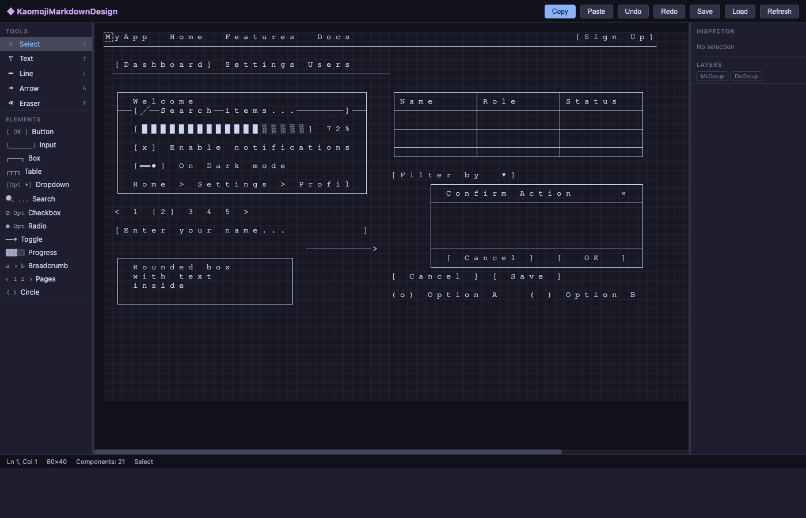
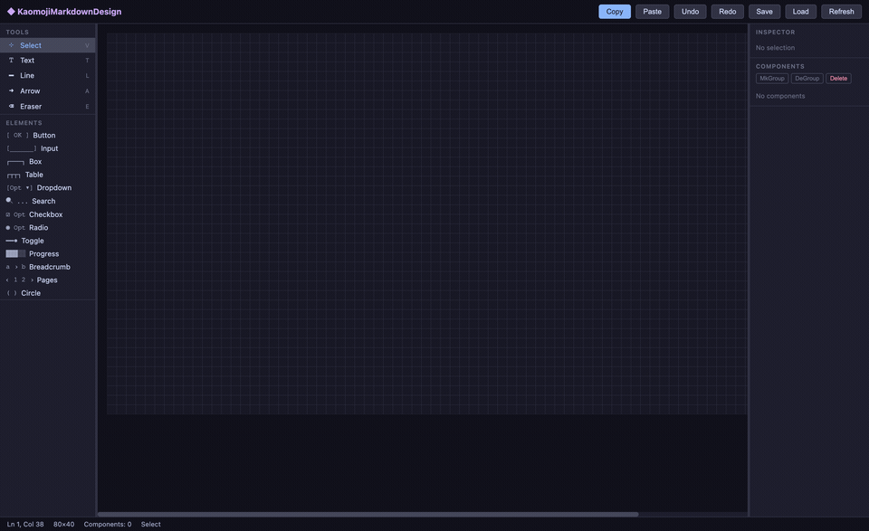

# KaomojiMarkdownDesign

A browser-based ASCII wireframe editor for designing UI mockups using Unicode box-drawing characters. Compiles into a single portable HTML file with zero external dependencies.



## What It Does

- **20 UI component types**: Button, Input, Box, Card, Table, Modal, Tabs, NavBar, Dropdown, Search, Checkbox, Radio, Toggle, Progress, Breadcrumb, Pagination, TextBox, Line, Arrow, Separator
- **5 border styles**: single (`┌─┐`), heavy (`┏━┓`), double (`╔═╗`), rounded (`╭─╮`), ASCII (`+-+`)
- **Interactive tools**: Select/Move/Resize, Pencil, Eraser, Brush for freehand drawing
- **Full editor UI**: Inspector panel, Components panel with z-ordering, drag-and-drop from palette
- **Multi-select**: Shift+click or marquee to select multiple components, drag together
- **Groups**: Group/Degroup selected components (Ctrl+G / Ctrl+Shift+G)
- **Smart border merge**: Overlapping box-drawing characters merge into correct junctions (corners → tees → crosses)
- **Inline text editing**: Double-click any text-bearing component to edit in place
- **Export**: Copy as Markdown, Save/Load JSON files, auto-save to localStorage
- **Keyboard shortcuts**: Undo/Redo, Copy/Paste/Cut, tool switching, Delete
- **Dark theme** with Catppuccin-inspired color palette

## Claude Code MCP Integration

The included MCP server lets [Claude Code](https://claude.ai/claude-code) **programmatically build wireframes** through natural language. Ask Claude to design a UI and it creates it directly in the editor — no manual dragging needed.



### What Claude Can Do

| Capability | Tools | Example |
|------------|-------|---------|
| **Add components** | `kaomoji_add_component` | "Add a login card at row 5, col 25" |
| **Layout & resize** | `kaomoji_move_component`, `kaomoji_resize_component` | "Make the navbar span the full width" |
| **Set properties** | `kaomoji_set_props` | "Change the card title to Sign In" |
| **Freehand drawing** | `kaomoji_pencil`, `kaomoji_eraser` | "Draw an ASCII avatar icon" |
| **Manage canvas** | `kaomoji_list_components`, `kaomoji_delete_component` | "Delete all buttons" |
| **Undo/Redo** | `kaomoji_undo_redo` | "Undo the last 3 changes" |
| **Export** | `kaomoji_export`, `kaomoji_export_json` | "Export as markdown" |
| **Import** | `kaomoji_import_json`, `kaomoji_clear` | "Load this wireframe JSON" |
| **Inspect** | `kaomoji_status`, `kaomoji_get_component` | "What's on the canvas?" |

**17 tools** total — Claude builds full-page wireframes in seconds:

```
"Design a dashboard with a sidebar, navbar, login form, data table, and progress bar"
```

### Setup

```bash
# Install MCP server
cd mcp && python3 -m venv venv && source venv/bin/activate
pip install -r requirements.txt

# Register in Claude Code config (~/.claude.json)
# Add under "mcpServers":
#   "kaomoji": {
#     "type": "stdio",
#     "command": "<path-to>/mcp/venv/bin/python",
#     "args": ["<path-to>/mcp/server.py"]
#   }

# Restart Claude Code, open the editor in a browser, then use kaomoji_* tools
```

### Run Tests

```bash
cd mcp && source venv/bin/activate && pytest tests/ -v
```

## Quick Start

### Development (multi-file)
Open `src/index.html` in a browser. Scripts load via individual `<script>` tags.

### Production (single file)
```bash
bash build.sh
# Output: dist/kaomoji-markdown-design.html (~165KB)
open dist/kaomoji-markdown-design.html
```

The single HTML file works from `file://` — no server needed.

## Example Output

The editor produces clean ASCII wireframes for documentation:

```
MyApp  Home  About  Docs                                               [Sign In]
────────────────────────────────────────────────────────────────────────────────
┌────────────────┐
│ MENU           │                                          Storage
│                │                                          [████████░░] 75%
│ > Dashboard    │       ┌────────────────────────────┐
│   Users        │       │ Sign In                    │
│   Settings     │       ├────────────────────────────┤
│   Reports      │       │ Email                      │
│                │       │ [you@example.com         ] │
│                │       │                            │
│                │       │ Password                   │
│                │       │ [********                ] │
│                │       │                            │
│                │       │ [ ] Remember me            │
│                │       │                            │
│                │       │ [       Sign In          ] │
│                │       │                            │
│                │       └────────────────────────────┘
│                │
│                │       ┌────────────┬────────────┬────────────┬─────────────┐
│                │       │Name        │Role        │Status      │Action       │
│                │       ├────────────┼────────────┼────────────┼─────────────┤
│                │       │            │            │            │             │
│                │       └────────────┴────────────┴────────────┴─────────────┘
│                │       Home > Dashboard > Settings       < 1 [2] 3 4 5 >
└────────────────┘
```

## Architecture

MVC pattern with HTML5 Canvas rendering:

```
App (orchestrator)
├── CharGrid (80×40 char buffer + compositing)
├── CanvasRenderer (fillText per cell)
├── UndoManager (50-level snapshot stack)
├── EventBus (pub/sub)
├── Tools (Select, Pencil, Eraser, Brush)
├── Components (20 types via ComponentRegistry)
├── UI Panels (Toolbar, Palette, Inspector, Components, StatusBar)
└── MCP Bridge (WebSocket client ↔ Python MCP server)
```

See [CLAUDE.md](CLAUDE.md) for the full development plan.

## Dependencies

**Runtime**: None (HTML5 Canvas, DOM, localStorage, Clipboard API — all browser-native)
**Build**: `bash` (for build.sh)
**Browser**: Chrome 60+, Firefox 55+, Safari 11+, Edge 79+
**Font**: System monospace (`"Courier New", "Courier", monospace`)

## Keyboard Shortcuts

| Shortcut | Action |
|----------|--------|
| V / T / L / A / P / E / B | Select / Text / Line / Arrow / Pencil / Eraser / Brush |
| Ctrl+Z / Ctrl+Shift+Z | Undo / Redo |
| Ctrl+C / Ctrl+V / Ctrl+X | Copy / Paste / Cut component |
| Ctrl+Shift+C | Copy as Markdown |
| Ctrl+S | Save to file |
| Delete / Backspace | Delete selected |
| Escape | Deselect |
| Double-click | Edit text inline |
