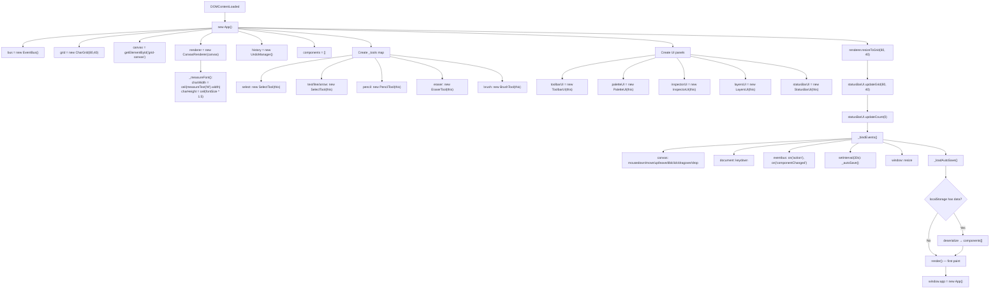
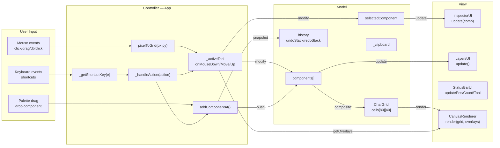
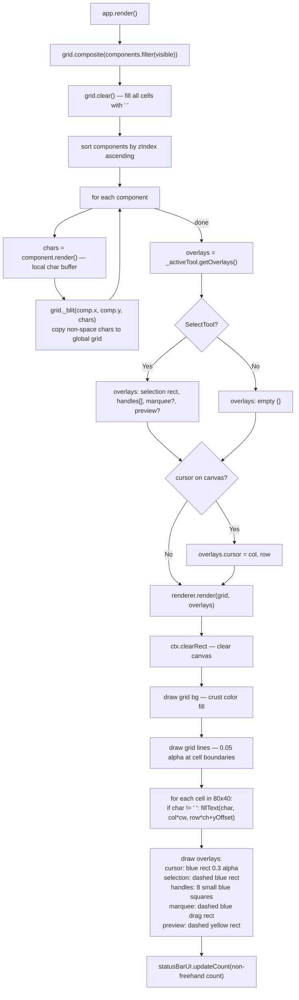
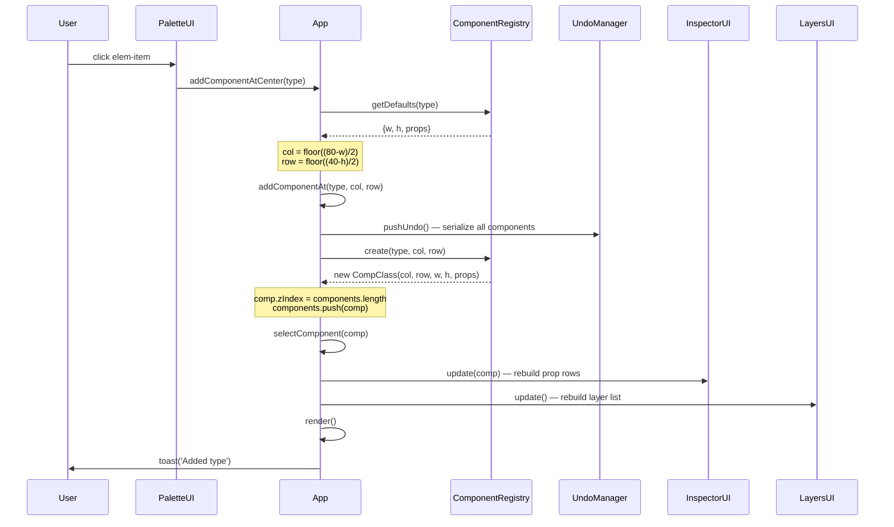
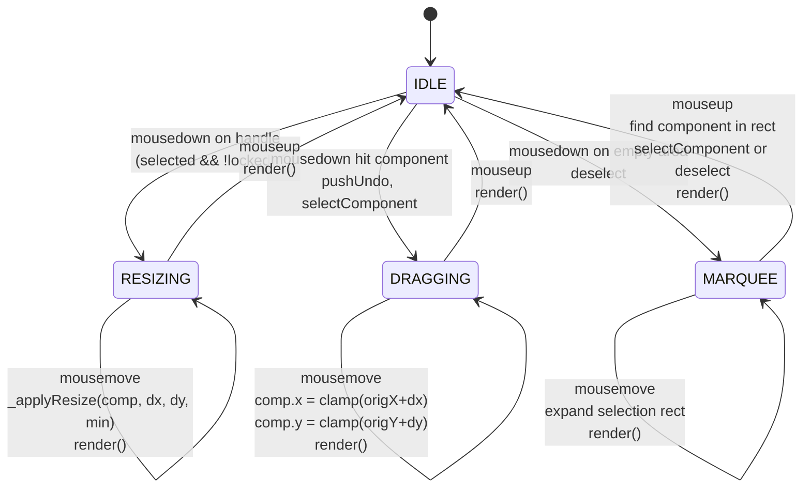
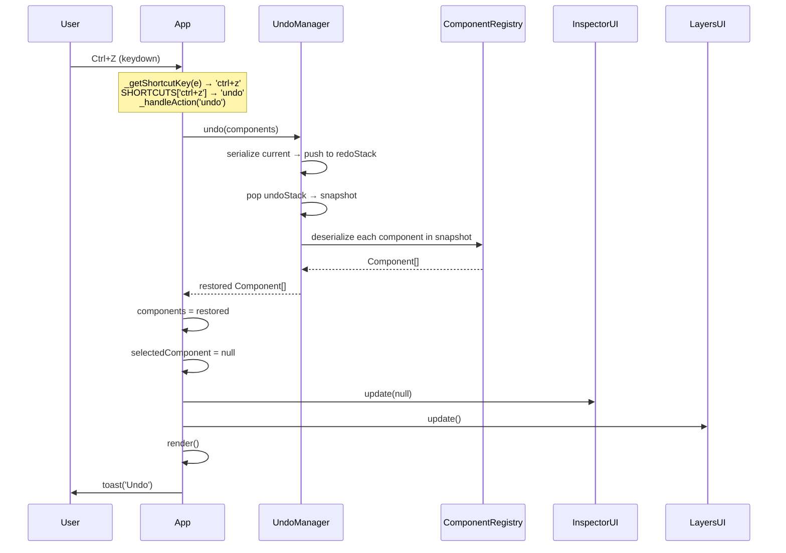
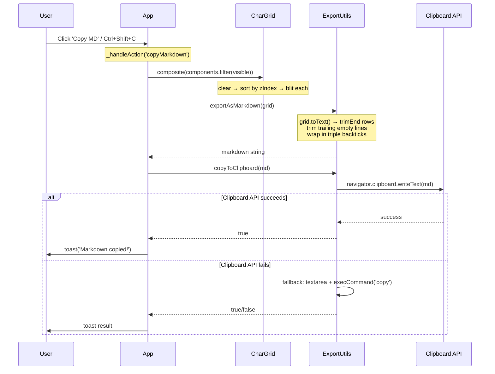

# 2.8 Function Flowcharts

> Extracted from [CLAUDE.md](../CLAUDE.md) Section 2.8. Mermaid diagrams showing how functions interact.

#### Main Initialization Flow

#### Data Flow Diagram (MVC)

#### Render Pipeline

#### Add Component from Palette

#### Drag Component on Canvas

#### Undo/Redo Flow

#### Save/Load Flow

```mermaid
flowchart TD
    subgraph SAVE["Save Flow"]
        S1["User clicks Save / Ctrl+S"] --> S2["ExportUtils.saveToFile(components)"]
        S2 --> S3["data = {version:1, gridCols, gridRows,<br/>components.map(serialize), timestamp}"]
        S3 --> S4["blob = new Blob(JSON.stringify(data))"]
        S4 --> S5["url = URL.createObjectURL(blob)"]
        S5 --> S6["a.href=url, a.download='wireframe.kaomoji.json'<br/>a.click()"]
        S6 --> S7["URL.revokeObjectURL(url)"]
        S7 --> S8["toast('Saved to file')"]
    end

    subgraph LOAD["Load Flow"]
        L1["User clicks Load / Ctrl+O"] --> L2["ExportUtils.loadFromFile()"]
        L2 --> L3["create hidden input type=file accept=.json"]
        L3 --> L4["input.click() → user selects file"]
        L4 --> L5["FileReader.readAsText(file)"]
        L5 --> L6["JSON.parse(result)"]
        L6 --> L7{"data.version === 1?"}
        L7 -->|No| L8["reject('Unsupported file version')"]
        L7 -->|Yes| L9["data.components.map(ComponentRegistry.deserialize)"]
        L9 --> L10["pushUndo, replace components,<br/>update UI panels, render()"]
        L10 --> L11["toast('Loaded from file')"]
        L8 --> L12["toast('Load failed: ...')"]
    end
```

#### Copy Markdown Flow

